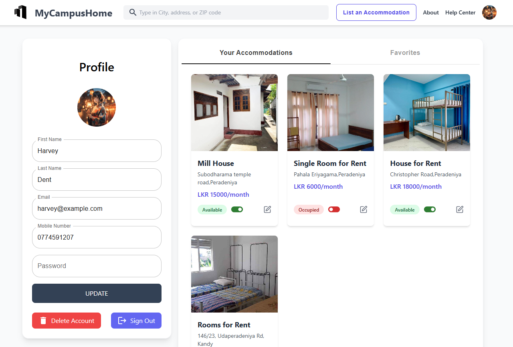

# MyCampusHome

MyCampusHome is a comprehensive web application designed to assist students in finding the perfect student accommodations. The platform offers an intuitive interface, responsive design, and integration with modern authentication and payment systems.

## Features

- **User Authentication**: Secure login and registration functionality with JWT.
- **Responsive Design**: Fully responsive UI built with Tailwind CSS, ensuring usability across devices.
- **Google Authentication**: One-click sign-in with Google.
- **Dynamic Search**: Explore student accommodations by location, price, and preferences.
- **Booking System**: Reserve and manage bookings easily.
- **Admin Panel**: Admin dashboard for managing properties, users, and bookings.

## Screenshots

Here are some screenshots of the MyCampusHome application:

### Homepage


### Login Page


### Accommodation Listing


### Profile Page


## Tech Stack

### Frontend
- **React.js**: Framework for building the user interface.
- **Tailwind CSS**: For styling the application.
- **React Router**: To handle navigation.
- **Axios**: For API requests.

### Backend
- **Node.js**: Server-side runtime.
- **Express.js**: Web application framework.
- **MongoDB**: Database for storing application data.
- **Mongoose**: MongoDB object modeling for Node.js.

### Authentication & Payment
- **JWT**: Secure JSON Web Tokens for user authentication.
- **Google OAuth**: Login using Google accounts.
- **Stripe (Planned)**: Seamless payment integration for bookings.

## Installation and Setup

### Prerequisites
- Node.js and npm installed
- MongoDB Atlas account or local MongoDB instance
- A Google Cloud Project for OAuth setup

### Frontend Setup

1. Clone the repository:
   ```bash
   git clone https://github.com/De-Silva-Madhushankha/MyCampusHome.git
   ```
2. Navigate to the client directory:
   ```bash
   cd mycampushome/client
   ```
3. Install dependencies:
   ```bash
   npm install
   ```
4. Start the development server:
   ```bash
   npm start
   ```

### Backend Setup

1. Navigate to the backend directory:
   ```bash
   cd mycampushome/server
   ```
2. Install dependencies:
   ```bash
   npm install
   ```
3. Configure environment variables:
   Create a `.env` file in the backend directory with the following:
   ```env
   MONGO_URI=your-mongodb-uri
   JWT_SECRET=your-jwt-secret
   GOOGLE_CLIENT_ID=your-google-client-id
   GOOGLE_CLIENT_SECRET=your-google-client-secret
   ```
4. Start the server:
   ```bash
   npm start
   ```

## Future Enhancements
- **Payment Integration**: Implement Stripe for handling payments.
- **User Notifications**: Notify users about booking updates and offers.
- **Enhanced Search**: Add filters for more specific accommodation searches.

## Contributing
Contributions are welcome! Please fork the repository and submit a pull request for any features, bug fixes, or enhancements.

## License
This project is licensed under the [MIT License](LICENSE).

